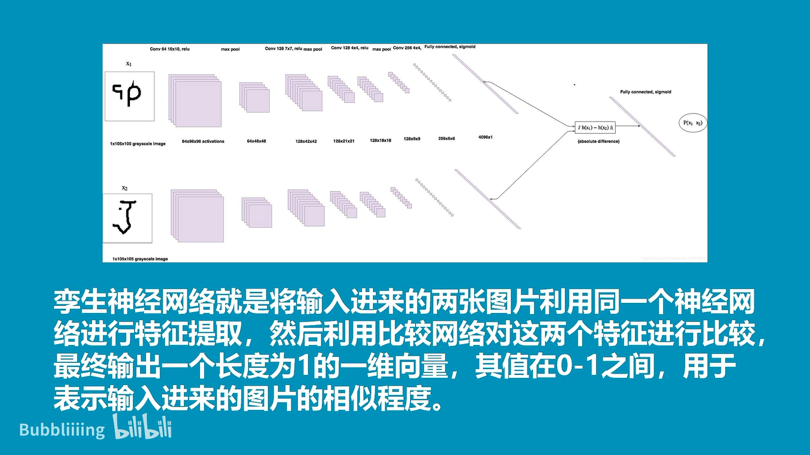
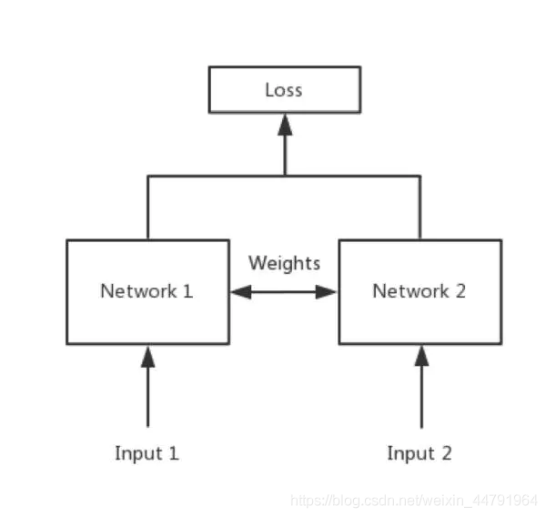
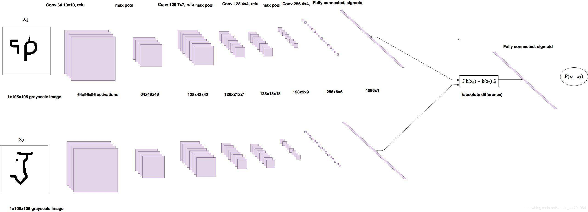
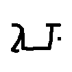
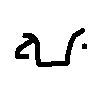
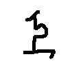
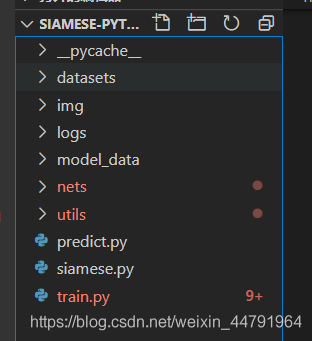
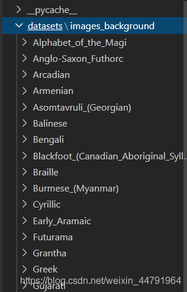
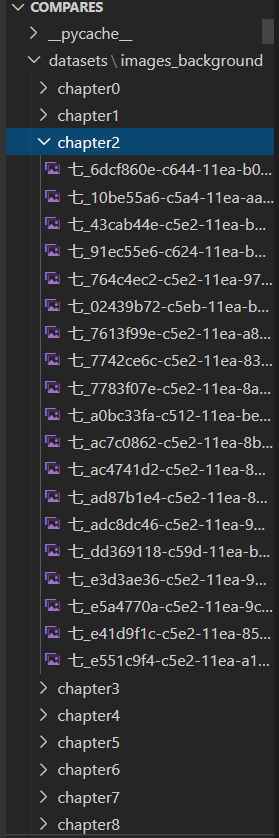
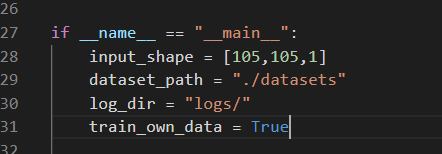

# 什么是孪生神经网络




简单来说，孪生神经网络（Siamese network）就是“连体的神经网络”，神经网络的“连体”是通过共享权值来实现的，如下图所示。



所谓权值共享就是当神经网络有两个输入的时候，这两个输入使用的神经网络的权值是共享的（**可以理解为使用了同一个神经网络**）。

很多时候，我们需要去**评判两张图片的相似性，比如比较两张人脸的相似性，我们可以很自然的想到去提取这个图片的特征**再进行比较，自然而然的，我们又可以想到**利用神经网络进行特征提取**。

如果使用两个神经网络分别对图片进行**特征提取，提取到的特征很有可能不在一个域中，此时我们可以考虑使用一个神经网络进行特征提取再进行比较**。这个时候我们就可以理解孪生神经网络为什么要进行权值共享了。

孪生神经网络有两个输入（Input1 and Input2），利用神经网络将输入映射到新的空间，形成输入在新的空间中的表示。通过Loss的计算，评价两个输入的相似度。

# 代码下载

https://github.com/bubbliiiing/Siamese-pytorch

# 孪生神经网络的实现思路

## 一、预测部分

### 1、主干网络介绍

> 如果两张图片大小相同,那么backbone的输出大小也相同
>
> 将backbone的输出结果平铺到一维上,两个向量长度相同,
>
> 两个向量进行相减取(相减就是对比)绝对值,得到特征差,
>
> 进行全连接到一维上,取sigmoid,输出到0~1之间,接近1说明相似



孪生神经网络的主干特征提取网络的功能是进行特征提取，各种神经网络都可以适用，本文使用的神经网络是VGG16。

关于VGG的介绍大家可以看我的另外一篇博客https://blog.csdn.net/weixin_44791964/article/details/102779878


这是一个VGG被用到烂的图，但确实很好的反应了VGG的结构：

1. **一张原始图片被resize到指定大小，本文使用105x105。**
2. **conv1包括两次[3,3]卷积网络，一次2X2最大池化，输出的特征层为64通道。**
3. **conv2包括两次[3,3]卷积网络，一次2X2最大池化，输出的特征层为128通道。**
4. **conv3包括三次[3,3]卷积网络，一次2X2最大池化，输出的特征层为256通道。**
5. **conv4包括三次[3,3]卷积网络，一次2X2最大池化，输出的特征层为512通道。**
6. **conv5包括三次[3,3]卷积网络，一次2X2最大池化，输出的特征层为512通道。**

> nets/vgg.py

```python
"""
unet主干特征提取部分
就是将vgg16的features部分按照maxp_pool分层
将分层之前获取的特征作为提取的内容,一共提取5次,下面forward中就是
"""

import torch
import torch.nn as nn
from torch.hub import load_state_dict_from_url

class VGG(nn.Module):
    def __init__(self, features, num_classes=1000):
        super().__init__()
        self.features = features
        self.avgpool = nn.AdaptiveAvgPool2d((7, 7))
        self.classifier = nn.Sequential(
            nn.Linear(512 * 7 * 7, 4096),
            nn.ReLU(True),
            nn.Dropout(),
            nn.Linear(4096, 4096),
            nn.ReLU(True),
            nn.Dropout(),
            nn.Linear(4096, num_classes),
        )
        self._initialize_weights()

    def forward(self, x):
        x = self.features(x)
        x = self.avgpool(x)
        x = torch.flatten(x, 1)
        x = self.classifier(x)
        return x

    def _initialize_weights(self):
        for m in self.modules():
            if isinstance(m, nn.Conv2d):
                nn.init.kaiming_normal_(m.weight, mode='fan_out', nonlinearity='relu')
                if m.bias is not None:
                    nn.init.constant_(m.bias, 0)
            elif isinstance(m, nn.BatchNorm2d):
                nn.init.constant_(m.weight, 1)
                nn.init.constant_(m.bias, 0)
            elif isinstance(m, nn.Linear):
                nn.init.normal_(m.weight, 0, 0.01)
                nn.init.constant_(m.bias, 0)

# 105, 105, 3 -> 105,105, 64 -> 105,105, 64 ->
# 52, 52,  64 -> 52, 52,  64 -> 52, 52, 128 ->
# 26, 26, 128 -> 26, 26, 128 -> 26, 26, 256 -> 26, 26, 256 ->
# 13, 13, 256 -> 13, 13, 512 -> 13, 13, 512 -> 13, 13, 512 ->
# 6,  6,  512 -> 6,  6,  512 -> 6,  6,  512 -> 6,  6,  512 ->
# 3,  3,  512
def make_layers(cfg, batch_norm=False, in_channels = 3):
    layers = []
    for v in cfg:
        if v == 'M':
            layers += [nn.MaxPool2d(kernel_size=2, stride=2)]
        else:
            conv2d = nn.Conv2d(in_channels, v, kernel_size=3, padding=1)
            if batch_norm:
                layers += [conv2d, nn.BatchNorm2d(v), nn.ReLU(inplace=True)]
            else:
                layers += [conv2d, nn.ReLU(inplace=True)]
            in_channels = v
    return nn.Sequential(*layers)

cfgs = {
    # 数字是out_channel
    'D': [64, 64, 'M', 128, 128, 'M', 256, 256, 256, 'M', 512, 512, 512, 'M', 512, 512, 512, 'M']
}
def VGG16(pretrained, in_channels, **kwargs):
    model = VGG(make_layers(cfgs["D"], batch_norm = False, in_channels = in_channels), **kwargs)
    if pretrained:
        state_dict = load_state_dict_from_url("https://download.pytorch.org/models/vgg16-397923af.pth", model_dir="./model_data")
        model.load_state_dict(state_dict)
    return model
```

### 2、比较网络


在获得主干特征提取网络之后，我们可以获取到一个多维特征，我们可以使用flatten的方式将其平铺到一维上，**这个时候我们就可以获得两个输入的一维向量了**

将这两个一维向量进行相减，再进行绝对值求和，相当于求取了两个特征向量插值的L1范数。也就相当于求取了两个一维向量的距离。

**然后对这个距离再进行两次全连接，第二次全连接到一个神经元上，对这个神经元的结果取sigmoid，使其值在0-1之间，代表两个输入图片的相似程度。**

> nets/siamese.py

```python
import torch
import torch.nn as nn

from nets.vgg import VGG16

#----------------------------------------------------------#
#   获取vgg的输出展平的长度
#----------------------------------------------------------#
def get_img_output_length(width, height):
    def get_output_length(input_length):
        # input_length += 6
        filter_sizes = [2, 2, 2, 2, 2]
        padding = [0, 0, 0, 0, 0]
        stride = 2
        for i in range(5):
            input_length = (input_length + 2 * padding[i] - filter_sizes[i]) // stride + 1
        return input_length
    return get_output_length(width) * get_output_length(height)

#----------------------------------------------------------#
#   将backbone的输出结果平铺到一维上,两个向量长度相同
#   两个向量进行相减取(相减就是对比)绝对值,得到特征差
#   进行全连接到一维上,取sigmoid,输出到0~1之间,接近1说明相似
#----------------------------------------------------------#
class Siamese(nn.Module):
    def __init__(self, input_shape, pretrained=False):
        super().__init__()
        self.vgg = VGG16(pretrained, input_shape[-1])
        # 删除无用的层
        del self.vgg.avgpool
        del self.vgg.classifier

        flat_shape = 512 * get_img_output_length(input_shape[1], input_shape[0])
        #------------------------------------------#
        #   b,512*3*3 -> b,512 -> b,1
        #------------------------------------------#
        self.fully_connect1 = .nn.Linear(flat_shape, 512)
        self.fully_connect2 = nn.Linear(512, 1)

    def forward(self, x):
        x1, x2 = x
        #------------------------------------------#
        #   我们将两个输入传入到主干特征提取网络
        #   result: b,512,3,3
        #------------------------------------------#
        x1 = self.vgg.features(x1)
        x2 = self.vgg.features(x2)
        #-------------------------#
        #   铺平
        #   b,512,3,3 -> b,512*3*3
        #-------------------------#
        x1 = torch.flatten(x1, 1)
        x2 = torch.flatten(x2, 1)
        #-------------------------#
        #   相减取绝对值
        #-------------------------#
        x = torch.abs(x1 - x2)
        #-------------------------#
        #   进行两次全连接
        #   b,512*3*3 -> b,512 -> b,1
        #-------------------------#
        x = self.fully_connect1(x)
        x = self.fully_connect2(x)
        return x
```

## 二、训练部分

### 1、数据集的格式

本文所使用的数据集为Omniglot数据集。

其包含来自 50不同字母（语言）的1623 个不同手写字符。每一个字符都是由 20个不同的人通过亚马逊的 Mechanical Turk 在线绘制的。

**相当于每一个字符有20张图片，然后存在1623个不同的手写字符，我们需要利用神经网络进行学习，去区分这1623个不同的手写字符，比较输入进来的字符的相似性。**

本博客中数据存放格式有三级：

```
- image_background/
	- Alphabet_of_the_Magi/	每个文件夹都是字体
		- character01/		每个文件夹都是同一个字
			- 0709_01.png
			- 0709_02.png
			- ……
		- character02/
		- character03/
		- ……
	- Anglo-Saxon_Futhorc/	每个文件夹都是字体
	- ……
```

**最后一级的文件夹(character01)用于分辨不同的字体，同一个文件夹里面的图片属于同一文字,相似度为1。在不同文件夹里面存放的图片属于不同文字,相似度为0。**





 **上两个图为.\images_background\Alphabet_of_the_Magi\character01里**的两幅图。它们两个属于同一个字。


 **上一个图为.\images_background\Alphabet_of_the_Magi\character02里**的一幅图。它和上面另两幅图不属于同一个字。

### 2、Loss计算

对于孪生神经网络而言，其具有两个输入。

**当两个输入指向同一个类型的图片时，此时标签为1。**

**当两个输入指向不同类型的图片时，此时标签为0。**

**然后将网络的输出结果和真实标签进行交叉熵运算，就可以作为最终的loss了。**

本文所使用的Loss为binary_crossentropy。

**当我们输入如下两个字体的时候，我们希望网络的输出为1。**


我们会将预测结果和1求交叉熵。

**当我们输入如下两个字体的时候，我们希望网络的输出为0。**




我们会将预测结果和0求交叉熵。

# 训练自己的孪生神经网络

## 1、训练本文所使用的Omniglot例子



下载数据集，放在根目录下的dataset文件夹下。



运行train.py开始训练。

## 2、训练自己相似性比较的模型

如果大家想要训练自己的数据集，可以将数据集按照如下格式进行摆放。

> 没有字体文件夹,直接将分类放入images_background/下面即可



每一个chapter里面放同类型的图片。

之后将train.py当中的train_own_data设置成True，即可开始训练。

